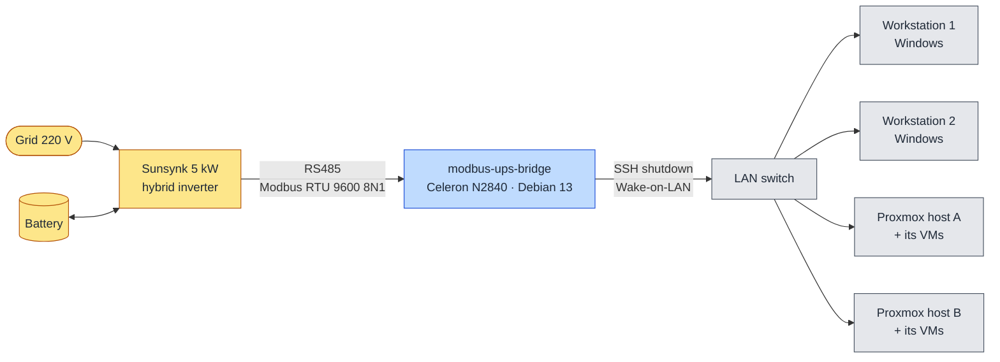
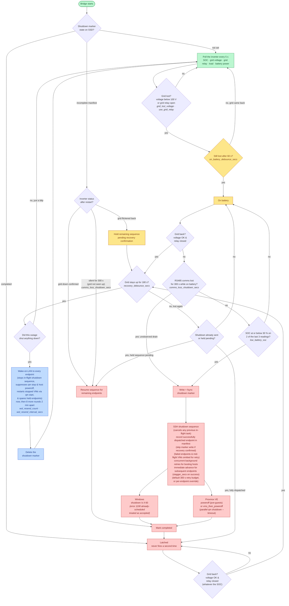
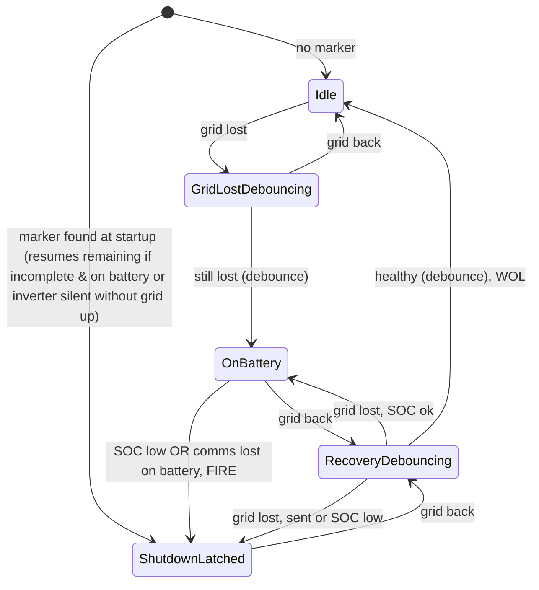

# modbus-ups-bridge

Modbus RTU poller for a Sunsynk 5kW hybrid inverter. No downstream UPS, no
NUT -- one Rust process reads the inverter over RS485, decides when to
shut things down, SSHes into each endpoint (2 Windows workstations, 2
Proxmox VE hosts) to do it gracefully, and sends Wake-on-LAN to bring
them back once grid power and battery SOC have recovered.

Needs Rust 1.77+ (the oldest version the locked dependencies accept).
Type-checks cleanly for `x86_64-unknown-linux-gnu`; not yet run on real
hardware.

## How it works

### Site overview



The inverter's AC output powers the bridge and all four endpoints.

### One outage, start to finish

Numbers are the defaults from `config/bridge.toml.example`; the setting
that controls each is named alongside it.



Around the whole loop: the watchdog is fed on every poll (and during
reconnection cycles), so if the bridge hangs the box reboots itself.
If the inverter stops answering while the grid is healthy, the bridge
logs the error and keeps retrying without shutting down; if communication
is lost while already on battery (or following an interrupted shutdown restart
without the grid having been seen up), `comms_loss_shutdown_secs` acts as a fail-safe
and fires (or resumes) the shutdown sequence before the battery drains unobserved
into the inverter's cutoff. If the grid was seen healthy before comms dropped,
waiting endpoints are spared from shutdown.

### State machine (`src/state.rs`)



| Transition | Exact condition | Action |
|---|---|---|
| GridLostDebouncing → OnBattery | grid lost for `on_battery_debounce_secs` | -- |
| OnBattery → ShutdownLatched | SOC ≤ `low_battery_soc` on 2 of the last 3 readings OR RS485 comms lost for `comms_loss_shutdown_secs` while on battery | **fire** the shutdown sequence (aborts any previous in-flight task) |
| ShutdownLatched → RecoveryDebouncing | grid back (whatever the SOC) | -- |
| RecoveryDebouncing → ShutdownLatched | grid lost and the shutdown was already sent | -- (no second shutdown) |
| RecoveryDebouncing → ShutdownLatched | grid lost, not yet sent, SOC low on 2 of the last 3 readings | **fire** the shutdown sequence (aborts any previous in-flight task) |
| RecoveryDebouncing → OnBattery | grid lost, not yet sent, SOC not (yet) confirmed low | -- |
| RecoveryDebouncing → Idle | grid back for `recovery_debounce_secs` (3 min) | **Wake-on-LAN** (stops in-flight shutdown, suppresses VM hard stops & host poweroff, restarts stopped VMs via `qm start`, with resends), only if a shutdown was sent |

*\* **Grid lost** is triggered if grid voltage < `grid_lost_voltage` OR grid relay (register 194) is open (`use_grid_relay = true`). **Grid back** requires both to be healthy: grid voltage at/above threshold AND grid relay closed (or unreadable).*

## Target platform

**Hardware:** fanless mini PC -- Intel Celeron N2840 (x86-64, 2 cores),
4 GB RAM, 128 GB SSD, 2x 1 Gb Ethernet, 2x onboard RS485 ports. The bridge
uses one RS485 port and a few MB of RAM; the rest is headroom.

**OS: Debian 13 "trixie" amd64**, minimal install (no desktop; select only
"SSH server" and "standard system utilities" in the installer).

- **Packages:** `openssh-client` (the only runtime dependency -- the bridge
  shells out to `ssh`). No libudev or other C libraries are linked.
- **Rust toolchain:** Debian 13's own `rustc` (1.85) is new enough --
  `apt install cargo` and build on the box itself. Or build on any x86-64
  Linux machine and copy the binary over.
- **RS485 port:**
  - Onboard ports are ordinary UARTs: `/dev/ttyS0`, `/dev/ttyS1` (some
    boards number them higher). `dmesg | grep ttyS` lists what the kernel
    found; the names are stable across boots.
  - Many of these boxes have a BIOS setting per COM port for
    RS232 / RS422 / RS485 -- set the inverter's port to **RS485**
    (2-wire, A/B). RS422 is the 4-wire mode and won't talk to the inverter.
  - These boards normally switch the RS485 transmit direction in hardware.
    If wiring, baud rate and slave id are right but every read times out,
    direction control is the next suspect -- check the board's manual.
  - Wire A/B to the inverter port its manual designates for RS485
    Modbus/monitoring -- not the port the battery's BMS uses. If nothing
    answers, swapping A and B is the classic first fix.
- **Watchdog:** the N2840's chipset has an Intel TCO watchdog. Check with
  `wdctl` or `ls /dev/watchdog`; if it's missing, `modprobe iTCO_wdt` (make
  it permanent via `/etc/modules-load.d/`). If the BIOS doesn't expose it,
  `softdog` is a fallback -- it still reboots the box if the bridge hangs.
  Only one process can hold the device, so leave systemd's own
  `RuntimeWatchdogSec` unset in `/etc/systemd/system.conf`.
  Stopping the service (`systemctl stop`) disarms the watchdog cleanly; a
  crash, hang or `kill -9` leaves it armed, so the box reboots within
  about 30 s unless systemd has restarted the bridge first (it does, after
  5 s).
- **Two Ethernet ports:** put the endpoints' LAN on one port. Keep
  `wol_broadcast_addr` as that LAN's subnet broadcast (e.g.
  `192.168.1.255:9`) -- the kernel then sends it out the right port. Don't
  use `255.255.255.255`: that only goes out the default-route port, which
  may be the other one.
- **Power:** the box must run from the inverter's output, like the
  endpoints -- **and so must the network switch** (and anything else)
  between the bridge and the endpoints: if the switch loses power first,
  the shutdown commands never arrive (Broadcom KB 421950 describes exactly
  this failure). Set the box's own BIOS "Power On after AC Loss" too, so it
  comes back by itself after a hard cutoff.
- **Logs:** `mkdir -p /var/log/journal` so the journal survives reboots on
  the SSD -- after an outage, that is where to see what the bridge did.
- **Time:** all debouncing uses the monotonic clock, so it doesn't matter
  whether the clock is set.

## The logic, plainly

- **Grid present (220V AC on the inverter's input) → nothing ever shuts
  down**, regardless of SOC. The gate on the whole shutdown path is two
  signals, and **either one** counts as "grid lost": the grid voltage
  (register 150) below `thresholds.grid_lost_voltage`, or the inverter's
  **grid side relay (register 194) open**. The relay matters because on a
  sagging grid the inverter disconnects and runs from the battery while the
  voltage register still reads well above 100 V. If register 194 can't be
  read, the voltage alone decides. Recovery needs both healthy: the voltage
  back *and* the relay closed.
- **Grid lost + SOC at or below `low_battery_soc` on 2 of the last 3
  readings → shutdown sequence fires once**, latched so it doesn't re-fire
  while still down or on a flapping grid. Requiring two readings means one
  stray value (say 0 % while the battery's BMS link hiccups) can't shut the
  site down; a real low battery fires one poll (5 s) later.
- **`low_battery_soc` must be set higher than `inverter_cutoff_soc`** (the
  inverter's own hardware/firmware low-SOC protection). The bridge checks
  this at startup and refuses to run if it isn't -- otherwise the inverter
  could cut its own output before the graceful sequence even finishes.
- **Grid back for `recovery_debounce_secs` (3 minutes), following a
  shutdown this process actually triggered → Wake-on-LAN sent** to every
  endpoint's configured MAC address, whatever the battery's SOC -- the
  machines don't wait for it to recharge. It is resent `wol_resend_count`
  times, `wol_resend_interval_secs` apart, so a machine that was still
  shutting down when the first round went out is woken once it's off.
  Machines already running ignore the extra packets.
- **The shutdown and progress are remembered across reboots of the bridge.**
  Before the sequence starts, the bridge creates `/var/lib/modbus-ups-bridge/shutdown_fired`
  on the SSD. As each endpoint successfully completes shutdown, its name is recorded
  to the manifest (`dispatched: <name>`).
  - Proxmox hosts (`vms_then_poweroff`) are recorded **only** after guest VMs finish
    stopping and host power-off is scheduled, preventing premature skipping if the
    bridge restarts during long VM shutdowns.
  - Endpoints that failed to shut down are **omitted** from the manifest. If any endpoint
    fails or exhausts its retry budget, `completed` is withheld from the marker; any subsequent
    restart during the outage (even long after the sequence ended) sees the marker as incomplete
    and retries only the failed machines.
  - If the bridge restarts mid-sequence and the grid flickers back for just one reading,
    remaining shutdowns are **not** discarded; they are held pending recovery confirmation.
    If the grid drops back down before `recovery_debounce_secs` (3 minutes), the remaining
    sequence resumes immediately. If the grid stays healthy, remaining endpoints are
    spared and Wake-on-LAN follows.
  - If the bridge restarts mid-sequence and the inverter is silent (cable fault, dead comms):
    no reading arrives to confirm whether the grid is down, and the battery is draining unseen.
    If no valid reading arrives for `comms_loss_shutdown_secs` (default 300 s), the fail-safe
    resumes the sequence (`inverter silent: resuming shutdown sequence`), shutting down the
    remaining endpoints before the inverter's hard hardware cutoff drops them ungracefully.
  - The marker file is removed only after the final Wake-on-LAN round finishes.
  Delete the file by hand only if you've brought the endpoints back yourself and don't
  want the wake-up round.
- **Booting hosts are retried in the background without delaying other endpoints (no head-of-line blocking).**
  If a machine is still booting from a previous wake-up when shutdown is triggered, its initial SSH connection will fail (`Connection refused` / timeout). Rather than blocking the entire queue and delaying other endpoints, the bridge delegates the booting machine to an asynchronous background retry task (retrying every 2 s) and immediately advances to the next endpoints in the sequence. Ready machines shut down immediately to shed battery load without delay. Booting machines shut down as soon as their SSH daemon comes up.
- **Extended, configurable retry budget for servers.**
  `ssh_connect_retry_secs` defaults to **300 s (5 minutes)**, allowing slow enterprise servers (UEFI memory training, IPMI, ZFS pool imports) ample time to finish booting. Individual endpoints can override this with their own `ssh_connect_retry_secs` in `[[endpoints]]` (up to 1800 s / 30 minutes).
- **Windows shutdown command treats already-scheduled shutdowns (Error 1190) as accepted.**
  If an SSH retry to a Windows machine occurs after a call that timed out client-side but actually initiated shutdown remotely, Windows returns `ERROR_SHUTDOWN_IN_PROGRESS` (1190: *"A system shutdown has already been scheduled"*). The bridge recognises the `(1190)` error suffix in any system language and treats the endpoint as successfully dispatched without retrying.
- **Fail-safe shutdown on losing inverter communication mid-outage (`comms_loss_shutdown_secs`).**
  If the inverter stops answering over RS485 (adapter unplugged, cable fault, serial driver issue) while the last valid reading indicated grid loss, the battery is draining unobserved. If no valid reading arrives for `comms_loss_shutdown_secs` (default 300 s / 5 minutes; 0 to disable), the bridge triggers the graceful shutdown sequence rather than letting the battery drain into the inverter's hard hardware cutoff. If the inverter went silent while the grid was healthy, it merely logs errors and retries indefinitely.
  This fail-safe also protects a restart that interrupted a shutdown: if the inverter stays silent for `comms_loss_shutdown_secs` after a restart with an incomplete manifest, the endpoints the previous run never reached are shut down automatically.
- **If the inverter cuts output on its own hardware protection instead**
  (bridge missed the window, misconfiguration, whatever) -- there's no
  standby power on the endpoints' NICs, so WOL can't reach them. That path
  depends entirely on each machine's own BIOS "Power On after AC Loss"
  setting: once grid returns and the inverter powers the load circuit
  again, they boot on their own. Set that BIOS option on all four machines
  as a backstop regardless of how well the graceful path works.

## What you must verify before deploying

1. **Register map** -- verify it on the real inverter first, step by step:
   [docs/register-verification.md](docs/register-verification.md). Taken from the Sunsynk/Deye "Modbus RTU Protocol"
   document V117 -- a copy is in
   [docs/protocol/](docs/protocol/), with V119. Defined once, as constants at the top of
   `src/modbus.rs` -- not in `bridge.toml`, because it belongs to the
   inverter model, not the site. To change it, edit it there and rebuild
   (and update `test/inverter_sim.py`, which keeps its own copy on purpose).

   | Register | Meaning | Unit |
   |---|---|---|
   | 0 | device type (0x0300 = single-phase storage) | -- |
   | 2 | protocol version (logged only) | e.g. 0x0102 = 1.2 |
   | 54 | V119 "AC power ratio" / V117 "EEPROM initial" (logged only, never written) | -- |
   | 150 | grid side voltage L1-N (decides grid lost, together with 194) | 0.1 V |
   | 178 | load side total power | 1 W, signed |
   | 184 | battery SOC | 1 %, 0-100 |
   | 190 | battery output power | 1 W, signed |
   | 194 | grid side relay status: 0 open (off grid) / 1 closed (on grid) -- with 150, decides grid lost | -- |
   | 213 | battery managed by 0 voltage / 1 capacity / 2 no battery | -- |
   | 217 | battery capacity ShutDown (inverter's own SOC cutoff) | 1 % |
   | 220 | battery voltage ShutDown | 0.01 V |

   On first connect, check the log line
   `inverter: device type 0x0300, ...` -- it confirms the port, slave id
   and addressing are right; the line after it shows registers 2 and 54,
   which tell which protocol version the firmware follows -- see
   [docs/protocol-versions.md](docs/protocol-versions.md) (V117 vs V119:
   no difference for shutdown or wake-up). Then compare the SOC and grid voltage in the
   debug log (`RUST_LOG=debug`) with the inverter's display once. While
   there, note which way the battery power (`batt=` in the debug log)
   goes when charging: the document doesn't say, the Deye convention is
   + discharging / - charging. It's only logged, never decided on.
2. **Inverter battery mode.** Set the inverter to manage the battery by
   **capacity (%)**, not voltage -- in voltage mode it cuts off at a
   battery voltage regardless of SOC, and the bridge's SOC threshold can't
   be guaranteed to come first. The bridge warns in the log if it finds
   voltage mode.
3. **`inverter_cutoff_soc`** matches the inverter's register 217 and
   **`low_battery_soc`** has real margin above it. The bridge checks the
   live values on every connect and logs an error if there is a discrepancy or
   no margin. The bridge refuses to operate only if data cannot be trusted (wrong device
   type in register 0); for other discrepancies it logs at Error level and continues running
   (unless `strict_inverter_checks = true` is configured). If the settings can't be read at
   all, it reconnects once, then monitors anyway and tries the check again every minute
   (strict mode keeps retrying instead).
4. **`wol_broadcast_addr`** matches your site's actual subnet, and that
   your switch doesn't filter broadcast traffic between the bridge and the
   endpoints.
5. **Grid detection.** With the inverter's grid breaker off, register 194
   (`relay=` in the debug log) must read **open**, and register 150
   (`grid=`) should fall below `grid_lost_voltage` (100 V) -- the document
   calls it the *grid side* voltage, which should read near 0 V without
   grid. These two are the only signals that start the shutdown path, so
   see them change once before relying on them. Also watch `relay=` while
   the grid comes back: it should return to **closed** on its own, a little
   after the voltage does. If register 194 turns out wrong on your unit
   (reads open with the grid on), set `use_grid_relay = false` and rely on
   the voltage; if it shows `relay=n/a`, the firmware doesn't answer for it
   and the bridge already falls back to the voltage alone (all standard Modbus
   exception responses from the inverter are treated as register unreadable,
   rather than transport faults, preventing reconnect loops on unsupported registers).

The bridge checks at startup, and refuses to start on, a wrong SOC range,
a `grid_lost_voltage` outside 1.0-400.0 V, a poll interval outside 1-10 s
(the watchdog margin), a malformed `wol_broadcast_addr` or MAC address,
duplicate endpoint names, and (when `vms_then_poweroff` is selected) a WOL
window shorter than `vm_shutdown_timeout_secs`. SSH key files that are missing
or readable by others are logged as errors (ssh refuses such keys).

## Layout

- `src/modbus.rs` -- polls the four registers (plus the grid relay flag, register 194) over RS485 RTU.
- `src/state.rs` -- debounced state machine (Idle / GridLostDebouncing /
  OnBattery / ShutdownLatched / RecoveryDebouncing). Fires the shutdown
  sequence exactly once per outage, and one Wake-on-LAN round (with its
  resends) per matching recovery.
- `src/persist.rs` -- the on-disk shutdown marker tracking dispatched endpoints
  and sequence completion across reboots, enabling mid-sequence resumption
  without duplicate commands.
- `src/remote_shutdown.rs` -- SSH shutdown sequence, endpoints started in
  configured order, `stagger_secs` apart. Each endpoint's initial SSH connection
  automatically retries transient connection errors (connection refused / timed out)
  every 2 s up to `ssh_connect_retry_secs` (e.g. if the host is still booting from a
  recent wake-up). Windows: native `shutdown /s /t ... /c "..."`. Proxmox VE, by `[proxmox] method`:
  `poweroff` (default) sends `/sbin/poweroff`, detached with `nohup` --
  Debian/Proxmox's systemd unit `pve-guests.service` stops all running VMs
  and containers gracefully with their configured timeout/ordering, then powers
  off the host; `vms_then_poweroff` has the bridge shut every running VM down
  in parallel (`qm shutdown <id> --timeout <secs>`, QEMU guest agent / ACPI; the calls
  start 250 ms apart so sshd's login limit doesn't drop some, and a call whose SSH
  connection fails is retried -- a VM the request never reached is **not** powered off hard),
  power off hard any VM still running after `vm_shutdown_timeout_secs` (`qm stop`),
  then `systemctl poweroff --no-block` (falls back to `/sbin/poweroff` if refused)
  -- each such host runs in parallel with the rest of the sequence. If recovery is confirmed
  while VM shutdowns are in progress or during the power-off delay, the bridge aborts destructive
  hard stops, cancels host power-off, and keeps watching the VMs for up to
  `vm_shutdown_timeout_secs` (+15 s), restarting each one that stops (including VMs still
  shutting down when recovery arrived) via `qm start`. Start at boot on each guest ensures VMs start
  again at boot after WOL. Which method to use is decided on site:
  [docs/proxmox-shutdown-test.md](docs/proxmox-shutdown-test.md).
  SSH host keys are pinned (`StrictHostKeyChecking=yes`); an endpoint whose
  key isn't recorded is reported at startup.
- `src/wol.rs` -- builds and broadcasts standard Wake-on-LAN magic packets.
- `src/watchdog.rs` -- feeds `/dev/watchdog` every poll loop; the bridge is
  the single point of failure for all four machines in this design, so a
  hang should reboot the board rather than silently stop signalling.
- `test/` -- the level-2 test kit (see Testing).
- `docs/protocol-versions.md` -- Sunsynk protocol V117 vs V119 comparison.
- `docs/protocol/` -- the Sunsynk Modbus protocol PDFs (V117, the file
  supplied as "V118", V119).
- `docs/register-verification.md` -- on-site procedure to check every
  register against the real inverter with `mbpoll`, plus a result sheet.
- `docs/installation.md` -- step-by-step installation, from compiling to
  a running service, plus updating and uninstalling.
- `systemd/journald-modbus-ups-bridge.conf` -- journal (log) retention and
  rotation for the box.
- `docs/proxmox-shutdown-test.md` -- on-site test deciding the Proxmox shutdown
  method (`poweroff` vs `vms_then_poweroff`), with a result sheet.

## Testing

Full explanation and step-by-step instructions: [TESTING.md](TESTING.md).

1. **Unit tests** -- `cargo test` (53 tests). The decision logic, config parsing, the
   inverter-settings check, the Proxmox commands, the marker file manifest, SSH connection
   retries for booting hosts, and Wake-on-LAN rounds, in under a second with no hardware.
2. **Simulated site** -- `test/`: the real binary against an inverter
   simulator on a virtual serial cable, with a fake `ssh` and a local
   Wake-on-LAN listener, on any Linux machine (including the N2840 before
   it goes to site). Needs no root and can't shut down anything. Start with
   `test/setup.sh`, then follow the 34 scenarios in
   [`test/CHECKLIST.md`](test/CHECKLIST.md) (32 automated in `test/auto_level2.py`).
3. **On site** -- the real inverter and machines: step 8 of the deployment
   sketch below, after [docs/register-verification.md](docs/register-verification.md)
   (inverter) and [docs/proxmox-shutdown-test.md](docs/proxmox-shutdown-test.md)
   (Proxmox hosts).

## Windows-side setup (per workstation)

1. Enable OpenSSH Server (not on by default):
   `Add-WindowsCapability -Online -Name OpenSSH.Server`, then set the
   `sshd` service to auto-start.
2. Create a dedicated **low-privilege local account** for this (Windows
   grants the shutdown privilege to standard Users by default, so this
   account does not need to be an Administrator -- and Administrator
   accounts require keys in the separate
   `C:\ProgramData\ssh\administrators_authorized_keys` path with locked-down
   ACLs, which is worth avoiding if you don't need it). Its public key goes
   in `C:\Users\ups-shutdown\.ssh\authorized_keys`; the profile folder only
   exists after the account has logged on once, so create it if needed.
   Test once by hand (`ssh -i <key> ups-shutdown@<host>`) that the shutdown
   is actually allowed from an SSH session before trusting it.
3. Lock the account's key down to a single command in
   `C:\ProgramData\ssh\sshd_config`, so a leaked key can do nothing but
   trigger a shutdown. Put the block at the **end** of the file (after the
   stock `Match Group administrators` block -- a `Match` runs until the next
   `Match` or end of file), then restart `sshd`:
   ```
   Match User ups-shutdown
       ForceCommand shutdown /s /t 60 /c "Inverter battery low, grid still down -- shutting down."
   ```
   **`ForceCommand` replaces whatever command the bridge sends**, so on a
   locked-down workstation this line alone decides the countdown: the
   endpoint's `shutdown_delay_secs` in `bridge.toml` is ignored. Keep the two
   at the same value so the config reflects what really happens, and change
   the delay here, not there. Note that any `/t` above 0 implies `/f`:
   when the countdown ends, open applications are closed without a chance
   to save.
4. Enable "Wake on Magic Packet" in the NIC's driver properties and in BIOS,
   so it survives the graceful shutdown and can be woken. On many boards
   waking from a full shutdown (S5) also needs BIOS "ErP"/"Deep Sleep"
   disabled, and on Intel NICs the driver's "Wake on Link Settings" /
   "Shutdown Wake-On-Lan" option enabled. Test a WOL wake from a full
   shutdown on each workstation.

## Deployment sketch

The full step-by-step guide -- BIOS, Debian, compiling, installing, SSH
keys, watchdog, logs, starting, updating -- is
[docs/installation.md](docs/installation.md). The outline:

1. On Debian 13 (see Target platform): `apt install openssh-client`,
   `cargo build --release`, copy `target/release/modbus-ups-bridge` to
   `/usr/local/bin/` and `systemd/modbus-ups-bridge.service` to
   `/etc/systemd/system/`.
2. Copy `config/bridge.toml.example` to
   `/etc/modbus-ups-bridge/bridge.toml`, fill in every VERIFY item and
   all four endpoints' real hosts/keys/MAC addresses.
3. Generate one SSH keypair for the Proxmox hosts and one for the
   workstations (or per-host, if you'd rather not share), without a
   passphrase, into `/etc/modbus-ups-bridge/`, and
   `chmod 600 /etc/modbus-ups-bridge/*_key` -- ssh refuses private keys
   others can read (the bridge logs an error at startup if so). Put the
   Proxmox public key in `/root/.ssh/authorized_keys` on each host. On each
   Proxmox host also check:
   - `nohup` exists: `ssh root@<host> 'which nohup'`. The shutdown command
     needs it to keep running after the SSH session ends.
4. From the bridge, as root, run one real SSH login to each of the four
   endpoints with its key (`ssh -i /etc/modbus-ups-bridge/proxmox_key
   root@<host> true` -- for the workstations this triggers their locked-down
   shutdown, so do it when that's fine). This proves the keys work and
   records each host key in `/root/.ssh/known_hosts`. **Required:** host
   keys are pinned, so the bridge only talks to endpoints recorded there;
   it logs an error at startup for each one missing. For the workstations,
   `ssh-keyscan` records the key without logging in
   (docs/installation.md, step 11).
5. Enable the systemd service: `systemctl enable --now modbus-ups-bridge`,
   and check `journalctl -u modbus-ups-bridge` shows
   `inverter: device type 0x0300` and no errors.
6. Confirm each Proxmox host's VM/CT Start/Shutdown order is configured
   (under VM Options: "Start/Shutdown order" and "Start at boot") and that
   QEMU guest agent is enabled in guests. Then run
   [docs/proxmox-shutdown-test.md](docs/proxmox-shutdown-test.md) on one host
   with a test VM: it checks that the shutdown command really shuts the
   VMs down cleanly and that the host comes back ready after Wake-on-LAN,
   and decides `[proxmox] method` in `bridge.toml`: `poweroff` (default)
   or `vms_then_poweroff`.
7. Set "Power On after AC Loss" in BIOS on all four machines and on the
   bridge box -- this is the backstop for the hard-cutoff case described
   above, independent of everything else here. Enable Wake-on-LAN from
   power-off (S5) in each machine's BIOS/NIC settings, and test it once per
   machine: servers' NICs often need it switched on separately.
8. Force a full test end to end: switch the grid off at the inverter's
   breaker, confirm the shutdown sequence, then restore grid and confirm
   Wake-on-LAN actually brings everything back -- before trusting any of
   this unattended. To rehearse without cutting the grid, temporarily
   **raise** `grid_lost_voltage` above the real grid voltage (e.g. `300.0`)
   and **raise** `low_battery_soc` just above the current SOC (the voltage
   test alone is enough: either signal counts as grid lost), then
   `systemctl restart modbus-ups-bridge`; put both back afterwards.

## Deliberately not handled here

- Telemetry/heartbeat back to Neuenhof over WireGuard -- worth adding once
  the core path is proven; not stubbed in to avoid guessing at your
  collector's protocol.
- Retry-with-backoff for executed commands -- commands that return non-zero exit codes
  once connected are logged on failure and the sequence continues to the next endpoint
  (transient SSH connection errors are already retried up to `ssh_connect_retry_secs`).
- systemd's own `sd_notify` watchdog integration -- only the hardware
  `/dev/watchdog` feed is implemented.
