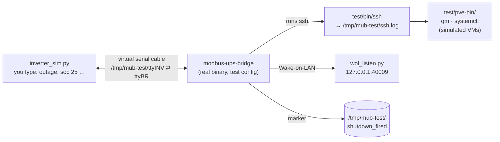

# Testing modbus-ups-bridge

This bridge decides when to shut down four machines, and when to bring them
back. A wrong decision either lets the inverter cut power under running
machines, or leaves them off after the grid returns. So it is tested at
three levels, from fastest to most realistic:

| Level | What runs | Needs | Time | Proves |
|---|---|---|---|---|
| **1. Unit tests** | Individual functions with made-up inputs | Rust only -- Windows or Linux | ~1 s | The **decisions** are right |
| **2. Simulated site** | The **real program**, with a fake inverter, fake SSH and a local Wake-on-LAN listener | Any Linux machine | ~1 hour for all scenarios | The **whole program** behaves right on a real clock, serial line and filesystem |
| **3. On site** | Everything real | The inverter, the N2840 and the four machines | half a day | The **real equipment** answers and reacts as expected |

This document covers levels 1 and 2. Level 3 is step 8 of the deployment
sketch in the [README](README.md#deployment-sketch), with two on-site
procedures: [docs/register-verification.md](docs/register-verification.md)
(inverter registers) and [docs/proxmox-shutdown-test.md](docs/proxmox-shutdown-test.md)
(Proxmox shutdown command).

**Status (2026-10-05).** Level 1: 49 tests, all passing on Debian 13 (48 on
Windows, where the one Linux-only test is skipped). Level 2: all 22 scenarios
(A-M plus the 60 s SSH timeout, F2 for mid-sequence restart resumption, F3 for grid flicker during restart, F4 for failed endpoint retry & Proxmox timing, N1-N5 for the Proxmox method
`vms_then_poweroff` against simulated VMs, and O for host booting / SSH connection retries) passing on Debian 13 under WSL2.
Earlier runs found and fixed a serial-port lock that stopped the bridge
reconnecting, `setup.sh` hanging when its output was piped, misleading
log lines, and SSH connection drop handling on Proxmox poweroff. Level 3
not yet done -- including which Proxmox method to use.

---

## Level 1 -- Unit tests

### What they are

Small pieces of Rust code that call the bridge's own functions with inputs
made up by the test, and check what comes back. They live at the bottom of
the source files they test, in a block like this:

```rust
#[cfg(test)]          // compiled only when testing, never into the real program
mod tests {
    use super::*;

    #[test]           // one test: passes if it runs to the end,
    fn some_case() {  // fails if an assert! is false or anything panics
        ...
    }
}
```

`cargo test` compiles the program in test mode, runs every `#[test]`
function and reports each one as `ok` or `FAILED`. No inverter, network,
Linux or root is involved.

### Why the logic is easy to test

The heart of the bridge, the state machine in `src/state.rs`, is a pure
decision function: it gets one inverter reading and returns what to do. It
never sends anything itself -- SSH, Wake-on-LAN and the marker file are
handled elsewhere.

```rust
let (status, action) = sm.observe(reading);
// action: None | TriggerShutdownSequence | TriggerWakeOnLan
```

So a state-machine test is a scripted story: a sequence of readings goes in,
and the test checks the actions that come out. Two helpers keep the stories
short:

- `reading(GRID_DOWN, 30.0)` -- a fake reading: grid 0 V, SOC 30 %
  (`GRID_UP` is 230 V).
- `thresholds(N)` -- the settings: shutdown at 30 % SOC, grid lost below
  100 V, grid-lost wait **0 s**, recovery wait **N s**.

**The timing trick.** The real waits are 60 s and 180 s; a test can't wait
that long. A wait of **0 s** passes at the next reading, so the story moves
on immediately. A wait of **3600 s** can never pass during the test, so the
state is guaranteed to stay put. That's also the main limit: the tests
can't check exact timings ("fires at 60 s, not at 59 s").

### The 49 tests

**State machine -- `src/state.rs`**

| Test | The story | What it proves |
|---|---|---|
| `grid_present_never_shuts_down` | Grid up, SOC at 5 %, five readings | The grid is the only gate: no grid loss, no shutdown, whatever the battery says |
| `fires_once_when_soc_low_on_battery` | Outage, SOC falls to 30 %, 29 %, then 25 % | Nothing on the first low reading; fires on the second -- and **only once** |
| `single_low_reading_does_not_fire` | Outage, isolated 0 % readings between normal ones | A stray reading (e.g. a BMS link hiccup) never shuts the site down |
| `two_of_the_last_three_low_readings_fire` | Outage, SOC 28 %, 31 %, 27 % | 2 low out of the last 3 is enough -- they needn't be consecutive |
| `grid_flap_then_low_soc_still_fires` | On battery, grid flickers back, drops again with SOC already low | The shutdown still fires. This was a real bug in the original code |
| `grid_flap_after_shutdown_does_not_refire` | After a shutdown, the grid flickers | No second shutdown |
| `wakes_when_grid_is_back_even_with_soc_still_low` | After a shutdown the grid returns, SOC still 21 % | Wake-on-LAN follows the recovery wait anyway -- it doesn't wait for the battery |
| `wol_only_after_a_real_shutdown` | A short outage, then a real one | No Wake-on-LAN after a blip; exactly one after a real shutdown |
| `resumed_after_reboot_wakes_on_recovery` | Bridge restarts with the marker file, grid back | It still wakes everything |
| `resumed_during_outage_does_not_refire` | Bridge restarts with the marker file, grid down | It stays latched: no second shutdown |

**Configuration -- `src/config.rs`**

| Test | What it proves |
|---|---|
| `example_config_loads` | The shipped `config/bridge.toml.example` parses and passes validation (this check would have caught the original config bug) |
| `level2_test_config_loads` | `test/bridge-test.toml` loads, uses its own marker file and has no watchdog |
| `misplaced_top_level_key_is_rejected` | A setting under the wrong `[section]` gives an error naming it, instead of being silently ignored |
| `bad_mac_is_rejected_at_startup` | A malformed MAC address stops the bridge at startup, naming the endpoint -- instead of failing silently at the first real wake-up |
| `wol_address_without_port_is_rejected_at_startup` | `wol_broadcast_addr` without `:port` stops the bridge at startup |
| `poll_interval_beyond_watchdog_margin_is_rejected` | A poll interval of 0 or above 10 s is refused (the 30 s watchdog would reboot the box between polls) |
| `duplicate_endpoint_names_are_rejected` | Two endpoints with the same name are refused (the log would be ambiguous) |
| `soc_outside_0_100_is_rejected` | SOC thresholds outside 0-100 % are refused |
| `grid_lost_voltage_outside_range_is_rejected` | Grid-lost voltage outside 1.0-400.0 V is refused (prevents 0 or negative voltage disabling outage detection) |
| `loose_ssh_key_permissions_are_reported` | *Linux only.* An SSH key readable by others, or missing, is reported at startup -- ssh would refuse it during a real shutdown |
| `old_register_settings_are_rejected` | A config that still sets register addresses (`reg_...`) is rejected: the register map lives in `src/modbus.rs` now, so the setting would do nothing |
| `proxmox_section_is_optional_and_defaults_to_poweroff` | A config without `[proxmox]` loads, with method `poweroff` and a 300 s VM timeout |
| `proxmox_vms_then_poweroff_can_be_selected` | `method = "vms_then_poweroff"` is accepted |
| `proxmox_bad_method_or_timeout_is_rejected` | An unknown method, or a VM timeout outside 10-1800 s, stops the bridge at startup |
| `wol_window_shorter_than_vm_timeout_is_rejected` | For `vms_then_poweroff`, a WOL window shorter than `vm_shutdown_timeout_secs` is refused (marker must not be cleared before host powers off) |
| `ssh_connect_retry_secs_beyond_limit_is_rejected` | An `ssh_connect_retry_secs` value > 600 s is refused |

**Inverter settings check -- `src/modbus.rs`**

| Test | What it proves |
|---|---|
| `capacity_mode_with_margin_is_ok` | Inverter cutoff 20 %, bridge acts at 30 % -- reported as OK |
| `capacity_mode_without_margin_is_an_error` | Inverter cutoff 30 %, bridge also at 30 % -- logged as an error |
| `voltage_mode_warns` | Inverter managing the battery by voltage -- logged as a warning |
| `wrong_device_type_warns` | Device isn't a single-phase storage inverter -- warning |
| `protocol_summary_decodes_version_and_shows_reg_54` | Register 2 is logged raw and decoded (0x0102 -> 1.2), with register 54 |
| `protocol_summary_survives_unreadable_registers` | Firmware that doesn't answer for register 2 or 54 gives `unreadable`, not an error |

**Other modules**

| Test | What it proves |
|---|---|
| `remote_shutdown::proxmox_command_runs_poweroff_detached` | The exact command string sent to the Proxmox hosts with method `poweroff` |
| `remote_shutdown::parses_qmlist_including_names_with_spaces` | `qm list` output is read correctly: IDs, names with spaces, header, and VM statuses |
| `remote_shutdown::power_states_command_covers_every_vm` | The exact power-state command sent for a list of VMs (`qm status`) |
| `remote_shutdown::selects_running_vms_and_treats_unknown_as_running` | VMs with status other than "stopped" count as running -- and a VM missing from the answer counts as running, so it's powered off rather than left behind |
| `remote_shutdown::recognises_qm_failure_text` | Failure text printed by `qm` (which may still exit 0) is recognised as a refused shutdown |
| `remote_shutdown::qm_shutdown_command_includes_timeout` | The `qm shutdown` command format includes `--timeout` for Proxmox VE |
| `remote_shutdown::distinguishes_timeout_from_guest_refusal` | Error classification accurately separates VM shutdown timeouts from guest agent refusals |
| `remote_shutdown::identifies_transient_connection_errors` | Distinguishes transient connection errors (connection refused, timed out, 255) from permanent auth or command failures |
| `remote_shutdown::stop_signal_resolves_on_true_but_not_on_a_dropped_sender` | Confirmed recovery stops the sequence from starting more endpoints, but a replaced sequence doesn't skip its stagger delays |
| `persist::set_is_set_clear_roundtrip` | The marker file is created (with its folder), is seen by a fresh instance -- i.e. after a reboot -- and is deleted |
| `persist::state_transitions_incomplete_and_completed` | Manifest states: Incomplete records dispatched endpoints in order, Completed marks finished sequence, NotSet when absent |
| `persist::failed_endpoint_omitted_from_marker_is_not_marked_dispatched` | Failed endpoints omitted from the marker manifest remain in the incomplete state for retry on restart |
| `persist::legacy_marker_parses_as_completed` | Backward compatibility with unformatted legacy marker files |
| `watchdog::feeds_then_disarms_through_a_clone_with_magic_v` | Feeding writes a zero byte; a requested stop writes the magic `V` through the stop handler's second handle, so `systemctl stop` doesn't reboot the box |
| `watchdog::without_a_watchdog_configured_everything_is_a_no_op` | With no `[watchdog]` section (e.g. the test config), feeding and disarming do nothing |
| `wol::parse_mac_handles_whitespace_and_separators` | MAC address parsing handles leading/trailing whitespace, dash or colon separators, and rejects invalid octets |
| `wol::sends_first_round_plus_resends` | Wake-on-LAN sends 1 + N rounds of valid 102-byte packets (caught on a local socket) |

### How to run them

**1. Install Rust** (1.77 or newer) -- once.

- Windows: install from <https://rustup.rs>.
- Debian 13: `sudo apt install cargo` (brings Rust 1.85).

Check with:

```bash
cargo --version
```

**2. Get the code.** Either work in your existing copy
(`D:\Git\modbus-ups-bridge`), or clone it. The repository is private, so
cloning needs your GitHub login (Git will ask, or use `gh auth login` first):

```bash
git clone https://github.com/dimon757/modbus-ups-bridge.git
```

**3. Run all tests** from the project folder:

```bash
cd modbus-ups-bridge
```
```bash
cargo test
```

The first run downloads and compiles the dependencies (a minute or two);
after that it takes seconds.

**Useful variants:**

| Command | Runs |
|---|---|
| `cargo test` | All tests (42 on Linux, 41 on Windows) |
| `cargo test state::` | Only tests whose name contains `state::` (the state machine) |
| `cargo test grid_flap` | Only tests with `grid_flap` in the name |
| `cargo test -- --nocapture` | All tests, also showing the bridge's log messages |
| `cargo clippy --all-targets` | Not a test: Rust's linter, flags suspicious code |

### Reading the result

A good run ends with:

```
test result: ok. 42 passed; 0 failed; 0 ignored; 0 measured; 0 filtered out; finished in 0.14s
```

A failing test is named, followed by the line where the check failed --
for example:

```
test state::tests::fires_once_when_soc_low_on_battery ... FAILED

---- state::tests::fires_once_when_soc_low_on_battery stdout ----
thread '...' panicked at src/state.rs:215:9:
assertion failed: is_shutdown(&a)

test result: FAILED. 38 passed; 1 failed; ...
```

The test name tells you which scenario broke; the file and line tell you
which expectation.

### Adding a test

Add a function to the `tests` block at the end of `src/state.rs`, using the
same helpers:

```rust
#[test]
fn my_scenario() {
    let mut sm = StateMachine::new(thresholds(3600), false);
    sm.observe(reading(GRID_DOWN, 50.0)); // grid lost -> GridLostDebouncing
    sm.observe(reading(GRID_DOWN, 50.0)); // -> OnBattery
    sm.observe(reading(GRID_DOWN, 29.0)); // 1st low reading: not yet
    let (_, action) = sm.observe(reading(GRID_DOWN, 28.0)); // 2nd: fires
    assert!(matches!(action, Action::TriggerShutdownSequence));
}
```

`StateMachine::new(settings, false)` starts normally; `true` simulates a
restart with the marker file present.

### What level 1 does not prove

That the real inverter answers on these registers, that SSH reaches the
machines, that they power off and wake up, or that the waits last exactly
60 s / 180 s. Levels 2 and 3 cover those.

---

## Level 2 -- Simulated site

### What it is

The **real compiled bridge** runs exactly as in production -- real clock,
real serial port, real Modbus traffic, real `ssh` calls, real Wake-on-LAN
packets, real marker file -- but everything *around* it is simulated:

| Real thing | Replaced by |
|---|---|
| Sunsynk inverter on RS485 | `test/inverter_sim.py` on a virtual serial cable (`socat`) |
| SSH to the 4 machines | `test/bin/ssh` -- writes to `/tmp/mub-test/ssh.log`; for the two Proxmox hosts it also runs the bridge's `qm`/`systemctl` commands against **simulated VMs** (`test/pve-bin/`) |
| Wake-on-LAN on the site LAN | packets to `127.0.0.1:40009`, shown by `test/wol_listen.py` |
| 60 s / 180 s / 30 s / 2 min waits | 5 s / 10 s / 2 s / 5 s (`test/bridge-test.toml`) |
| `/var/lib/modbus-ups-bridge/shutdown_fired` | `/tmp/mub-test/shutdown_fired` |



Nothing in level 2 needs root, uses the network, or can shut down or reboot
anything: the fake `ssh` never connects, Wake-on-LAN only goes to
`127.0.0.1`, and the test config has no watchdog.

### The files in `test/`

| File | Role |
|---|---|
| `setup.sh` | Prepares everything: checks tools, creates a Python environment with the pinned pymodbus, verifies the simulator, starts the virtual cable. Also `reset`, `stop`, `clean` |
| `inverter_sim.py` | The fake Sunsynk: Modbus RTU slave 1 at 9600 8N1, with the real register addresses; values editable while it runs |
| `self_check.py` | Reads every simulator register back with a real Modbus client, to catch an address shifted by one before it confuses a test |
| `bin/ssh` | The fake `ssh`: logs what would have been run; can pretend an endpoint is unreachable or hanging; for the fake Proxmox hosts, executes the bridge's `qm`/`systemctl` commands |
| `pve-bin/qm`, `pve-bin/systemctl` | The fake Proxmox tools: simulated VMs that shut down after a few seconds, hang, or have no QEMU guest agent, supporting `--timeout` and accurately simulating blocking Proxmox shutdown semantics; a `systemctl` that can refuse poweroff to test the `/sbin/poweroff` fallback |
| `wol_listen.py` | Prints each Wake-on-LAN packet and the MAC it targets, grouped into rounds |
| `bridge-test.toml` | The test config (short waits, local addresses, own marker and `known_hosts`, no watchdog), Proxmox method `poweroff` |
| `bridge-test-vms.toml` | The same, with Proxmox method `vms_then_poweroff` and a 15 s VM timeout -- for scenarios N (`./run-bridge.sh vms`) |
| `run-bridge.sh` | Builds the bridge and starts it with the test config, the fake `ssh` first on `PATH`, and debug logging |
| `requirements.txt` | pymodbus 3.15.0 and pyserial 3.5, pinned -- pymodbus changes its API between versions |
| `CHECKLIST.md` | The 20 scenarios (A-M, F2, N1-N5, O), with the exact log lines to expect |

### How to run it

#### Step 1 -- a Linux machine

Any Linux works; these instructions are for **Debian 13** (the bridge's own
OS). Options:

- **The N2840 bridge box itself**, before it goes to site -- the most
  realistic choice. If the real service is already installed, stop it first
  so the two don't compete:
  ```bash
  sudo systemctl stop modbus-ups-bridge
  ```
- A Debian virtual machine.
- **WSL2 on Windows**: in an administrator PowerShell, `wsl --install -d Debian`,
  reboot, then open "Debian" from the Start menu.

#### Step 2 -- install the tools (once)

```bash
sudo apt update
```
```bash
sudo apt install git cargo socat python3 python3-venv
```

| Package | Used for |
|---|---|
| `git` | getting the code |
| `cargo` | building the bridge (Rust 1.85 on Debian 13) |
| `socat` | the virtual serial cable |
| `python3`, `python3-venv` | the simulator, self-check and Wake-on-LAN listener |

#### Step 3 -- get the code (once)

```bash
git clone https://github.com/dimon757/modbus-ups-bridge.git
```

The repository is private: Git asks for your GitHub username and a
**personal access token** as the password (github.com → Settings →
Developer settings → Personal access tokens). Alternatively copy the
project folder over (USB stick, `scp`).

Optional but recommended -- run level 1 here first, to confirm the build
works on this machine:

```bash
cd modbus-ups-bridge && cargo test
```

#### Step 4 -- set up the test environment (each session)

```bash
cd modbus-ups-bridge/test
```
```bash
./setup.sh
```

The first time, it creates a Python environment in `/tmp/mub-test/venv` and
installs pymodbus (a minute). Every time, it runs the simulator self-check,
clears old results and starts the virtual cable. It ends with:

```
Ready. Virtual cable: /tmp/mub-test/ttyINV (simulator) <-> /tmp/mub-test/ttyBR (bridge)

Open four terminals in .../modbus-ups-bridge/test:
  1. inverter:  /tmp/mub-test/venv/bin/python inverter_sim.py --serial /tmp/mub-test/ttyINV
  2. WOL:       python3 wol_listen.py
  3. ssh log:   tail -f /tmp/mub-test/ssh.log
  4. bridge:    ./run-bridge.sh

Then work through CHECKLIST.md. Between scenarios: ./setup.sh reset
```

If the self-check fails, `setup.sh` prints what didn't match and stops --
don't continue, the simulator would give wrong answers.

#### Step 5 -- open the four terminals

Open four terminal windows (or tabs), each in the `test` folder, and start
one program in each -- **in this order**:

| # | Terminal | Command | What you see |
|---|---|---|---|
| 1 | **Inverter** | `/tmp/mub-test/venv/bin/python inverter_sim.py --serial /tmp/mub-test/ttyINV` | The register values, then a `sim>` prompt -- this is where you type |
| 2 | **Wake-on-LAN** | `python3 wol_listen.py` | `listening for Wake-on-LAN on 127.0.0.1:40009` |
| 3 | **SSH log** | `tail -f /tmp/mub-test/ssh.log` | Empty until a shutdown fires |
| 4 | **Bridge** | `./run-bridge.sh` | Builds (first time), then logs one line per second |

On a machine without a desktop (e.g. the N2840 over SSH), use `tmux` for
the four panes: `sudo apt install tmux`, run `tmux`, split with
`Ctrl+b %` and `Ctrl+b "`, move between panes with `Ctrl+b` + arrow keys.

#### Step 6 -- the first check: scenario A

Without typing anything, the bridge terminal should show:

```
loaded config from .../test/bridge-test.toml (4 endpoint(s))
inverter: device type 0x0300, battery mode 1, cutoff 20% / 46.00 V
inverter settings: inverter cutoff 20% SOC, shutdown sequence at 30% -- 10 points of margin
soc=80.0% grid=230.0V load=500W batt=0W on_battery=false low_battery=false
soc=80.0% grid=230.0V load=500W batt=0W on_battery=false low_battery=false
...
```

The `device type 0x0300` line proves the whole chain works: bridge →
virtual cable → simulator → back. If instead you see
`modbus poll failed: timed out reading register ...`, the simulator isn't
running or is on the wrong port -- see Troubleshooting.

#### Step 7 -- work through the scenarios

Open [`test/CHECKLIST.md`](test/CHECKLIST.md) and go through the scenarios
in order. Each says what to type at the `sim>` prompt (or which file to
create) and gives the exact log lines to expect, as tick boxes. Before each
scenario from D onwards:

```bash
./setup.sh reset
```

This clears the SSH log, the marker file and any simulated SSH failures.
The simulator and bridge can keep running.

| | Scenario | You do | Must happen |
|---|---|---|---|
| A | Normal running | nothing | Inverter identified, 1 poll/s, no actions |
| B | Grid blip | `outage`, `restore` within 3 s | Ignored |
| C | Outage, battery OK | `outage`, wait, `soc 50`, `restore` | No shutdown, **no** Wake-on-LAN |
| D | Full outage | `outage`, `soc 25` … `restore` | Fires on the 2nd low reading; 4 SSH commands 2 s apart; latched; wake-up 10 s after the grid is back, even with the battery still low; 4 Wake-on-LAN rounds; marker removed |
| E | Flicker with low battery | `soc 35`, `outage`, `restore`, `soc 30`, `outage` | Shutdown fires (regression test) |
| F | Bridge restart mid-outage | run D, Ctrl+C the bridge, restart | Resumes latched, no second shutdown, wakes on recovery |
| F2 | Bridge restart mid-sequence | partial manifest in marker, restart bridge | Resumes remaining endpoints without re-calling dispatched ones; completes sequence |
| F3 | Grid flicker during restart | restart during grid blip, outage resumes | Holds sequence while grid is temporarily up; resumes immediately when grid drops; completes cleanly |
| F4 | Failed endpoint retry & Proxmox timing | endpoint fails, Proxmox VM delay, restart | Failed endpoints and mid-flight VMs omitted from marker; retried on restart; Proxmox host recorded only after poweroff |
| G | Inverter silent | Ctrl+C the simulator for 15 s | Errors and retries, **no** shutdown |
| H | Garbage SOC | `set 184 150` during an outage | Bad read, **no** shutdown |
| I | Cutoff without margin | `set 217 30`, restart bridge | Error logged |
| J | Voltage mode | `set 213 0`, restart bridge | Warning logged |
| K | New outage during wake-up | outage while Wake-on-LAN rounds run | Rounds cancelled, new shutdown |
| L | Endpoint unreachable | `ssh-fail` file | That one fails, the rest still shut down |
| M | Endpoint hangs, grid returns | `ssh-hang` file, then `restore` | Bridge keeps polling; rest of sequence stopped; wake-up follows |
| N1 | Proxmox `vms_then_poweroff` (`./run-bridge.sh vms`) | `outage`, `soc 25` | Every VM shut down in parallel with native `--timeout` and confirmed off, then `systemctl poweroff`; the two hosts in parallel |
| N2 | Hung VM, VM without guest agent | extra lines in the fake host's `vms` file | Missing guest agent detected immediately; hung VM hard-stopped after 15 s timeout -- both hosts still powered off |
| N3 | `systemctl poweroff` refused | `systemctl-refuse` file | Falls back to `/sbin/poweroff` |
| N4 | Grid back mid-way | `restore` while a host waits for a hung VM | That host still completes; Wake-on-LAN brings it back |
| N5 | Proxmox host unreachable | `ssh-fail` file | Logged; the other host still shut down |
| O | Host booting on wakeup (SSH retry) | `ssh-booting-<host>` file | Initial attempts return connection refused; retried every 2 s up to `ssh_connect_retry_secs`, then succeeds; all endpoints complete |

#### Step 8 -- finish

Stop the four programs with `Ctrl+C`, then:

```bash
./setup.sh clean
```

This stops the virtual cable and deletes `/tmp/mub-test`. If you stopped
the real service on the N2840 in step 1, start it again:

```bash
sudo systemctl start modbus-ups-bridge
```

### Simulator commands

Typed at the `sim>` prompt in terminal 1. Changes take effect at the
bridge's next poll (within 1 s).

| Command | Effect |
|---|---|
| `outage` | Grid voltage 0 V (register 150) |
| `restore` | Grid voltage 230 V |
| `grid 180` | Any grid voltage |
| `soc 25` | Battery SOC 25 % (register 184) |
| `load 1500` | Load power (register 178) |
| `batt -800` | Battery power (register 190); Deye convention: + discharging, - charging |
| `set 217 30` | Any register; value may be hex (`0x0300`) or negative |
| `show` | Current values of all simulated registers |
| `help` | The command list |
| `quit` | Stop the simulator (also `Ctrl+C`) |

Stopping and restarting the simulator resets it to its starting values:
grid 230 V, SOC 80 %, cutoff 20 %, capacity mode.

### Simulating SSH problems

The fake `ssh` reads files in `/tmp/mub-test`:

| File | Effect for the listed host | Example |
|---|---|---|
| `ssh-fail` | Fails immediately, like a machine that's off or unreachable | `echo 10.99.0.3 >> /tmp/mub-test/ssh-fail` |
| `ssh-hang` | Never answers, until the bridge's 60 s SSH timeout kills it | `echo 10.99.0.2 >> /tmp/mub-test/ssh-hang` |
| `ssh-booting-<host>` | Returns simulated `Connection refused` for N attempts, then succeeds | `echo 2 > /tmp/mub-test/ssh-booting-10.99.0.1` |

The test endpoints are `10.99.0.1` (ws-1), `10.99.0.2` (ws-2), `10.99.0.3`
(proxmox-a) and `10.99.0.4` (proxmox-b). `./setup.sh reset` removes both files and
restores the fake Proxmox hosts' default VMs (see CHECKLIST.md, scenarios N).

### Troubleshooting

| Symptom | Cause and fix |
|---|---|
| `socat missing` / `venv failed` | Install the packages from step 2 |
| `simulator self-check FAILED` | The pymodbus version differs from the pinned one: `rm -rf /tmp/mub-test/venv`, then `./setup.sh` again |
| `run-bridge.sh`: `no virtual serial cable` | Run `./setup.sh` first (also needed after a reboot -- `/tmp` is cleared) |
| Bridge: `modbus poll failed: timed out reading register 0x00b8` right from the start | The simulator isn't running, or was started without `--serial /tmp/mub-test/ttyINV` |
| Bridge: `modbus connect failed: ... No such file or directory` | The virtual cable is down: `./setup.sh stop`, then `./setup.sh` |
| `wol_listen.py`: `Address already in use` | An old listener is still running: close it, or `pkill -f wol_listen.py` |
| `cargo build` fails: `... requires rustc 1.77 or newer` | Rust too old: on Debian 13 `apt install cargo` is new enough; elsewhere use <https://rustup.rs> |
| Nothing in ssh.log although the log says the shutdown fired | The fake `ssh` isn't first on `PATH`: always start the bridge with `./run-bridge.sh`, not the binary directly |
| States change a second or two later than the checklist says | Normal: the bridge polls once a second, and each wait is measured from the poll that noticed the change |

### What level 2 does not prove

Level 2 proves the program as a whole: decisions on the real clock, Modbus
over a serial line, the exact commands handed to `ssh`, Wake-on-LAN
packets and rounds, the marker surviving a restart, and that failures
(silent inverter, garbage data, a dead or hung machine) never cause a wrong
shutdown or stall the bridge.

It does **not** prove that the real Sunsynk answers the same way, that SSH
logins work on the real machines, or that they really power off and wake
up. That is level 3, on site: step 8 of the
[deployment sketch](README.md#deployment-sketch).
