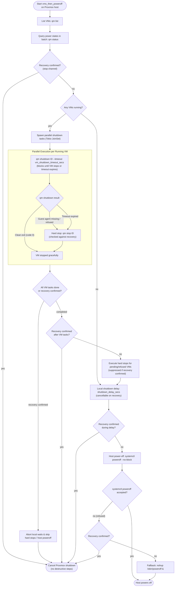

# Proxmox VE shutdown test -- which method should the bridge use?

The bridge can shut a Proxmox VE host down in two ways, chosen with `method` in
the `[proxmox]` section of `bridge.toml`:

| `method` | What the bridge does | Relies on |
|---|---|---|
| `poweroff` (default) | Sends `/sbin/poweroff` detached with `nohup` | Proxmox's systemd unit `pve-guests.service` to stop running VMs and containers cleanly with their configured timeout/ordering, then powers off the host |
| `vms_then_poweroff` | Asks every running VM to shut down in parallel (`qm shutdown <id> --timeout <timeout>`, via QEMU guest agent / ACPI), waits up to `vm_shutdown_timeout_secs`, powers off hard any still running (`qm stop <id>`), then `systemctl poweroff --no-block` (`/sbin/poweroff` fallback if refused) | The bridge directly querying and managing each VM. Every VM's shutdown and status is explicitly logged by the bridge |

> [!NOTE]
> If a grid flap triggers a shutdown while a Proxmox host is still booting from a previous Wake-on-LAN round, the bridge automatically retries its initial SSH connection every 2 seconds for up to `ssh_connect_retry_secs` (default 90 s) until the host's `sshd` becomes available.

This test settles which method works best for your Proxmox VE hosts on the real
hardware, in about an hour, with one test VM:

- **Test A** -- `poweroff`, the bridge's default method.
- **Test B** -- `vms_then_poweroff`, the explicit multi-step method.

For each method, verify:

1. Are the VMs shut down **cleanly** (not cut off)?
2. Does the host **power off** by itself?
3. After power returns and Wake-on-LAN is sent, does the host come back **ready**,
   with VMs configured with "Start at boot" started automatically?

## Safety first

- Use a host with **only a test VM running** -- no production VMs.
- **Stop the bridge** on the bridge box so it cannot act during the test:
  `sudo systemctl stop modbus-ups-bridge` (start it again at the end).
- Do the test with grid power on. Nothing here requires an actual power outage.

## Preparation (once)

### 1. Record the Proxmox version and check commands

SSH to the Proxmox VE host as root and run:

```bash
pveversion -v
```
```bash
which qm systemctl poweroff nohup
```

Write the Proxmox version on the result sheet.

### 2. A test VM with QEMU Guest Agent

- A small VM (Windows or Linux) with **QEMU Guest Agent installed and running**
  (`qemu-guest-agent` service on Linux, or VirtIO guest tools on Windows).
- In the Proxmox web interface, under the VM's **Options**, ensure **QEMU Guest Agent** is **Enabled**.
- Ensure the test VM is running.

### 3. Autostart / Start at boot settings

In the Proxmox web interface:
- Select the VM → **Options** → **Start at boot** → set to **Yes**.
- Optionally configure **Start/Shutdown order** and **Shutdown timeout** (e.g. timeout: 120 s).

### 4. Wake-on-LAN configuration

On the Proxmox host, check that the network interface supports Wake-on-LAN:

```bash
ethtool <interface> | grep "Wake-on"
```

If `Wake-on: d` (disabled), enable magic packet wake-up:

```bash
ethtool -s <interface> wol g
```

To make this persistent across reboots in Debian/Proxmox, add `link-wake-on-lan magic` or an `up` rule in `/etc/network/interfaces` or systemd-networkd / udev rules.

On the bridge box, install `wakeonlan`:
```bash
sudo apt install wakeonlan
```
You will need the host's MAC address (from `ip link` on the host) and the subnet broadcast address.

## How to judge "clean shutdown" in the guest

After each test, start the test VM (or let autostart start it) and inspect the previous shutdown record:

- **Windows guest**, in PowerShell:
  ```powershell
  Get-WinEvent -FilterHashtable @{LogName='System'; Id=1074,6008,41} -MaxEvents 5 | Format-List TimeCreated,Id,Message
  ```
  - **1074** at the test time ("... initiated the power off ..."): **clean**.
    The process named in the message is typically `qemu-ga.exe` (QEMU Guest Agent) or `System` (ACPI).
  - **6008** ("The previous system shutdown ... was unexpected") or **41** (Kernel-Power): **not clean** -- the VM was cut off.
- **Linux guest**:
  ```bash
  journalctl -b -1 -n 20
  ```
  The previous boot's log should end with standard shutdown messages (e.g. `Reached target System Power Off` or `Power-Off`). If it stops abruptly without unmounting filesystems, it was cut off.

---

## Test A -- `poweroff`, the bridge's default method

Sends exactly what the bridge sends, from the bridge box with the bridge's key:

1. In a second SSH session to the Proxmox host, monitor the log if desired:
   `tail -f /tmp/ups-shutdown.log`
2. On the bridge box -- record the start time:
   ```bash
   sudo ssh -i /etc/modbus-ups-bridge/proxmox_key -o BatchMode=yes root@<proxmox-host> "nohup sh -c 'sleep 10; /sbin/poweroff' > /tmp/ups-shutdown.log 2>&1 < /dev/null &"
   ```
   The SSH command must return within a few seconds (the shutdown sequence runs detached in the background).
3. Watch the test VM in the Proxmox web GUI: after the 10 s delay, `pve-guests.service` should request guest shutdown, and the VM should change from running to stopped.
4. Note the time the host is **fully off** (fans stop, power LED off).
5. **Recovery:** from the bridge box, send Wake-on-LAN:
   ```bash
   wakeonlan -i <subnet-broadcast> <proxmox-mac>
   ```
6. When the Proxmox host boots up:
   - Check that the web GUI is accessible.
   - Verify that the **test VM started automatically** (via "Start at boot").
7. Check the guest's shutdown record (clean event 1074 or clean systemd log).

---

## Test B -- `vms_then_poweroff`, the bridge's explicit method



Run the individual steps by hand from the bridge box to verify each command:

1. **List the VMs** as the bridge does:
   ```bash
   sudo ssh -i /etc/modbus-ups-bridge/proxmox_key -o BatchMode=yes root@<proxmox-host> "qm list"
   ```
   Note the test VM's VMID.
2. **Read VM power state**:
   ```bash
   sudo ssh -i /etc/modbus-ups-bridge/proxmox_key -o BatchMode=yes root@<proxmox-host> 'for id in <vmid>; do echo "$id $(qm status $id)"; done'
   ```
   Expect `<vmid> status: running`.
3. **Request guest shutdown**:
   ```bash
   sudo ssh -i /etc/modbus-ups-bridge/proxmox_key -o BatchMode=yes root@<proxmox-host> "qm shutdown <vmid> --timeout 180"
   ```
   On Proxmox VE, `qm shutdown <vmid>` blocks until the VM stops or `--timeout` expires.
   The bridge runs shutdowns for all running VMs concurrently in parallel via Tokio tasks, passing `--timeout <vm_shutdown_timeout_secs>` and relaxing the per-call SSH timeout ceiling accordingly. If a guest agent is missing, `qm shutdown` fails quickly; if a guest takes longer than `--timeout`, it exits with an error and the bridge hard-powers it off with `qm stop <vmid>`. If confirmed recovery occurs at any point while VM shutdowns are in progress, remaining local waits are aborted, destructive hard stops (`qm stop`) are strictly suppressed, and the host power-off is cancelled.
4. **Verify power state** after shutdown finishes (or check via step 2).
   Note how long the VM took to shut down. (The setting `vm_shutdown_timeout_secs` must exceed this duration).
5. **Power off the host**:
   ```bash
   sudo ssh -i /etc/modbus-ups-bridge/proxmox_key -o BatchMode=yes root@<proxmox-host> "systemctl poweroff --no-block"
   ```
   *(If `systemctl poweroff` is ever refused by permissions or systemd, test the fallback:)*
   ```bash
   sudo ssh -i /etc/modbus-ups-bridge/proxmox_key -o BatchMode=yes root@<proxmox-host> "nohup sh -c 'sleep 10; /sbin/poweroff' > /dev/null 2>&1 < /dev/null &"
   ```
6. Note the time until the host is fully off. Wake with `wakeonlan`, check that the test VM auto-starts, and verify clean shutdown in the guest.

---

## Decision -- set `method` in `bridge.toml`

| Test A (`poweroff`) | Test B (`vms_then_poweroff`) | Recommended Setting in `[proxmox]` |
|---|---|---|
| All OK | All OK | **`method = "poweroff"`** (simpler, one SSH call, lets Proxmox manage guest ordering) or **`vms_then_poweroff"`** (explicit bridge logging per VM and guaranteed hard-stop deadline) |
| All OK | Not OK | **`method = "poweroff"`** (default) |
| Not OK | All OK | **`method = "vms_then_poweroff"`** |
| Not OK | Not OK | Verify QEMU Guest Agent in the guest and Proxmox node settings. |

After modifying `bridge.toml`: `sudo systemctl restart modbus-ups-bridge`.

Make sure to restart the bridge service when testing is complete:
```bash
sudo systemctl start modbus-ups-bridge
```

---

## Result sheet

Date: ______________ Proxmox host: ______________ `pveversion`: ______________________________

Test VM (OS): ______________ QEMU Guest Agent: Enabled / Running  Start at boot: Yes / No

| Metric | Test A (`poweroff`) | Test B (`vms_then_poweroff`) |
|---|---|---|
| Time command sent | | |
| SSH returned quickly without error | | |
| VM completed clean guest shutdown | | |
| VM stopped duration (s) | -- | |
| Time host fully off | | |
| Total shutdown duration | | |
| Host woke via Wake-on-LAN | | |
| Test VM auto-started after boot | | |
| Guest record clean (1074 / clean journal) | | |
| **Method OK?** | | |

Decision: ☐ `method = "poweroff"` ☐ `method = "vms_then_poweroff"`
